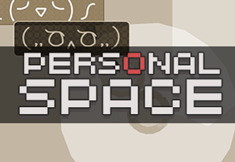

_Personal Space_ is a top-down view walking simulation game made during [2017 Columbia University Game Jam](https://www.facebook.com/events/190019838156134) under the theme "Space". In this game, player walks to their destination on a crowded street with the Porcupine Law in mind - neither stay too far nor too close to others.

* Design: [Lea Liu](https://www.lealiu.com/), [leav](https://github.com/leav/), [Wangshu Sun](http://www.sunwangshu.com/)
* Program: [leav](https://github.com/leav/), [Wangshu Sun](http://www.sunwangshu.com/)
* Art: [Lea Liu](https://www.lealiu.com/)
* BGM: [Wangshu Sun](http://www.sunwangshu.com/)

[**Play WebGL version**](https://leav.github.io/Personal-Space/)

Use mouse to control.
